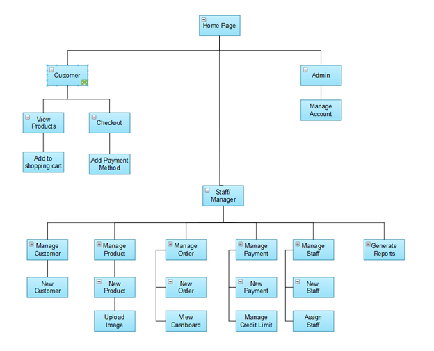
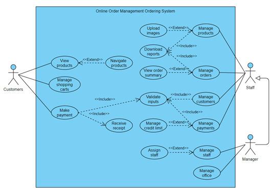
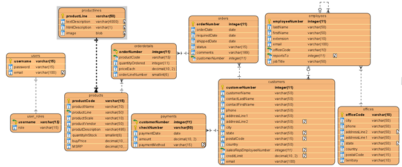
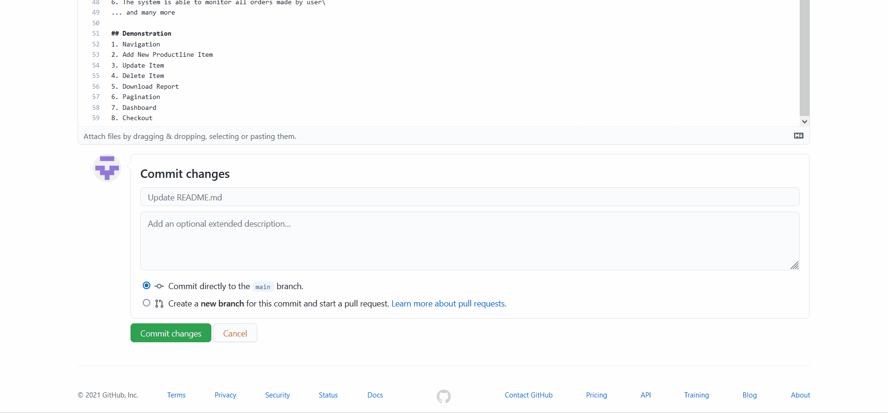
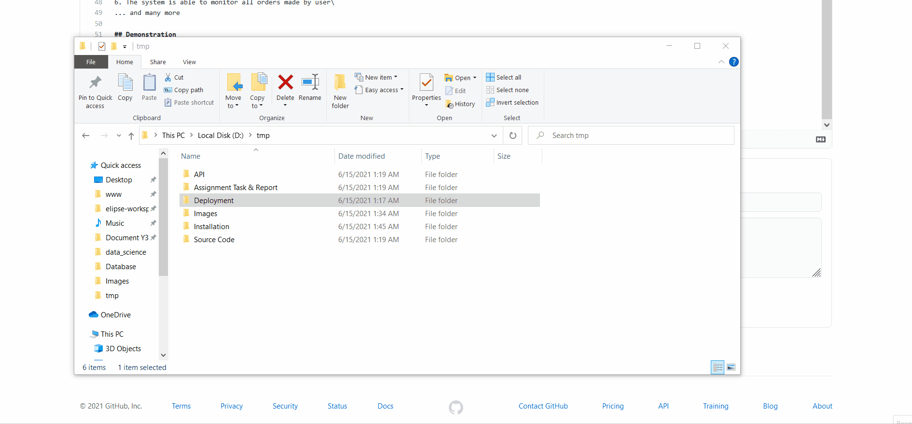
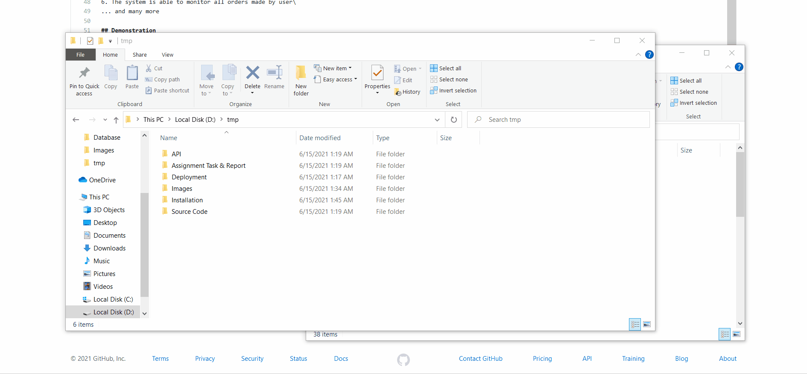

# Jan2021-SideServer
UCCD3243 Server-Side Web Applications Development\
Task: Design an **Online Order Management Monitoring System** (Ecommerce Website) with Side Server capabilities and PostgreSQL Database

## Groupmates
1. Tan Xi En (Leader)
2. Yap Jheng Khin
3. Yeoh Siow Poo
4. Yeong Huei Kei

## Assignment Task
1. Design Website Web page using HTML and CSS. Bootstrap is allowed and encouraged
2. Design ERD Diagram for the Online Order Management Monitoring System
3. Design SQL Script Based on ERD Diagram
4. Define Business Requirement of Online Order Management Monitoring System
5. Design System Architecture of the system (Layered Architecture)
6. Create System based on MVC architecture => Controller (Servlet), View => JSP
7. Create Java Classes to handle entities (ORM Mapping)

## Learning Objective
1. Familiarize Myself with PgSQL Syntax
2. Familiarize Myself with OOP Concepts
3. Familiarize Myself with Side Server Concept such as Controller (Servlet), View (JSP)
4. Learn to program full stack Website using MVC Layout

## Software Used
1. Eclipse 2019-06 (Java EE IDE)
2. WildFly Server (17.0.1)
3. PostgreSQL DBMS (ver 12)
4. Visual Paradigm Community Edition

## Libraries Used
Bootstrap v4.6, JQuery, JDK 11

## Functional Hierarchy Chart

## Use Case Diagram

## ERD Diagram

## How To Install
1. Create New Database in PgAdmin Shell Script
   
2. Upload SQL Script to PostgreSQL Database
   
3. Replace Standalone.xml in the Wildfly Folder
   
4. Upload WAR File to WildFly Server
   

## Program Functions
1. The system is able to manage daily operations, CRUD Operations of Client
2. The system is able to create new users
3. The system is able to monitor any transactions made by user
4. The system is able to add in new product or remove Item
5. The system is able to add in new employees or branch
6. The system is able to monitor all orders made by user\
... and many more

## Demonstration
1. Navigation
2. Add New Productline Item
3. Update Item
4. Delete Item
5. Download Report
6. Pagination
7. Dashboard
8. Checkout
